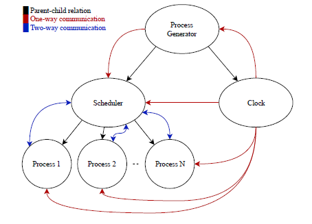

<div align="center">
  
  [](https://github.com/D4rk1n/OS_Proj/contributors)
  [](https://github.com/D4rk1n/OS_Proj/issues)
  [](https://github.com/D4rk1n/OS_Proj/network)
  [](https://github.com/D4rk1n/OS_Proj/stargazers)
  [](https://github.com/D4rk1n/OS_Proj/blob/master/LICENSE)
  
  
  
  

</div>

# Table of Contents

- [Table of Contents](#table-of-contents)
- [About The Project](#about-the-project)
  - [Data structures used](#data-structures-used)
  - [Algorithm description](#algorithm-description)
- [Installation](#installation)
- [Running](#running)
- [Roadmap](#roadmap)
- [Contributing](#contributing)
- [License](#license)
- [Contributers:](#contributers)

# About The Project

> A CPU scheduler determines an order for the execution of its scheduled processes; it
decides which process will run according to a certain data structure that keeps track
of the processes in the system and their status.
<br>A process, upon creation, has one of the three states: Running, Ready, Blocked (doing
I/O, using other resources than CPU or waiting on unavailable resource).
<br>OS for 1 CPU and fixed memory size 1024 byte



## Data structures used
- LinkedList for storing processes and memory free list.
- Dynamic array (vector) for storing weighted turnaround time.

## Algorithm description

> The process generator readsinput,initiate and create the scheduler and clock processes.
<br>The scheduler  communicates  with  the  process  generator  through  2  semaphores and  message queues.<br> Whenever the process generator finishes it sends a message to the scheduler and busy waits till it’s killed.<br>The scheduler forksthe process and, for phase 2, allocates its memoryFor phase 2, We store the memory free list in an array with size 11 memory segments from 2^0 to 2^10, every index in the free list is a linked list ofsorted allocated memory segmentsTheprocessupdatesitsremaining time and stores it in a shared memoryso thescheduler can access it .Every one clock Scheduler takes the lead and pause the running process with semaphores .Every one clock Scheduler receives the data from Process generator, updates the running process PCB,  decides  to  stop the  running process  and  start  other one  or not according to the  selected algorithm (RR, SRTN, HPF) Thescheduler will remove the process from the queue and, for phase 2, deallocate the memory used by this processwhenthe remaining time of the process is zero.

- Assumptions : 
  - No process can arrive at 0 (this causes inconsistency as the program requires time to initialize)
  - In phase 2 RR, If a process cannot be allocated (insufficient memory) it proceeds to the next process and if it is at the end it wraps around.
  - In phase 2, If 2 or more processes have the same everything except memory size it does NOT get sorted by the memory size. We just get the same order of the process generator.
  - The compiled programs is **.out** (not .o). it matters as we arecalling them by name in the code.<br/> You can use this snippet for compiling the program. <br/> PS: the -lm argument while compiling scheduler is necessary.
  ```sh 
  gcc process_generator.c -o process_generator.out
  gcc clk.c -o clk.out
  gcc scheduler.c -lm -o scheduler.out
  gcc process.c -o process.out 
  ```
# Installation

1. **Clone the repository**

```sh
$ git clone https://github.com/D4rk1n/OS_Proj
```
2. **Navigate to repository directory**
```sh
$ cd OS_Proj
```
# Running

run ```./process_generator.out-h``` to see explanation of the arguments

# Roadmap

See the [open issues](https://github.com/D4rk1n/OS_Proj) for a list of proposed features (and known issues).

<!-- CONTRIBUTING -->

# Contributing

Contributions are what make the open source community such an amazing place to be learn, inspire, and create. Any contributions you make are **greatly appreciated**.

1. Fork the Project
2. Create your Feature Branch (`git checkout -b AmazingFeature-Feat`)
3. Commit your Changes (`git commit -m 'Add some AmazingFeature'`)
4. Push to the Branch (`git push origin AmazingFeature-Feat`)
5. Open a Pull Request

<!-- LICENSE -->

# License

Distributed under the MIT License. See `LICENSE` for more information.

# Contributers:

<table>
  <tr>
    <td align="center"><a href="https://github.com/fuboki10"><br /><sub><b>Abdelrahman Tarek</b></sub></a><br /></td>
    <td align="center"><a href="https://github.com/Hassan950"><br /><sub><b>Hassan Mohamed</b></sub></a><br /></td>
    <td align="center"><a href="https://github.com/D4rk1n"><br /><sub><b>Abdelrahman Arafat</b></sub></a><br /></td>
    <td align="center"><a href="https://github.com/alyabozied"><br /><sub><b>Aly Abozied</b></sub></a><br /></td>
  </tr>
 </table>